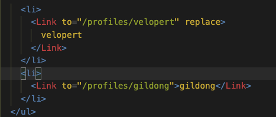

# React Router, parameter, query, 서브 라우터

## react-router-dom

SPA앱을 만들 때 많이 사용되는 패키지
SPA를 구현한다는 것은 방문자들이 앱 전체를 다운로드 받지 않아도 되게 만들어 주는 데에 의미가 크다.
해당 요청에 맞는 컴포넌트만 라우팅 하여 부분적으로 렌더링하는 것을 의미함.

- React-router - 웹 & 앱
- react-router-dom - 웹
- react-router-native - 앱

## BrowserRouter

react-router-dom 의 라우터는 BrowserRouter와 HashRouter 두 가지가 있다.

BrowserRouter는 HTML5의 history객체의 값을 가져와 이용하는 방법이다. (pushState, replaceState, popState event)

[History API - Web API | MDN](https://developer.mozilla.org/ko/docs/Web/API/History_API)

### basename

기본 url

```jsx
<BrowserRouter basename="/calendar">
  <Link to="/today" /> //---->>> /calender/today
</BrowserRouter>
```

### forceRefrech

true일 경우 페이지 전체가 refresh

## HashRouter

URL의 hash를 활용한 라우터이다. 정적인 (static) 사이트에 적합하다.

특징은 URL에 #가 붙는데, URL해시를 서버에서 읽을 수 없기 떄문에 Server Side Rendering으로 백업이 불가.

또한 해시 히스토리를 지원하지 않는다. (해시히스토리나 브라우저 히스토리의 차이는 url의 어떤 부분으로부터 로케이션 객체를 생성하느냐에 있다. browser history는 url전체, 해시 히스토리는 해시 뒤의 값을 참조)

## Route

현재 URL에 매치된 컴포넌트를 렌더링해주는 컴포넌트, path를 사용한다.

## Switch

Route나 Redirect 중 첫 번째 자식 요소중 location 에 매칭된 것들을 렌더해줌.

매치되는 것이 없으면 맨 마지막 404페이지를 만들어 줄 수도 있고

매치되는 것이 여러 개일 경우 (예를 들면 / 를 Home 으로 쓸 때)

여러 개가 렌더링 될 수 있기 때문에 exact 옵션을 붙여서 정확한 컴포넌트만 렌더링 해줄 수도 있다.

```jsx
<Route path="/about">
  <About />
</Route>
<Route path="/:user">
  <User />
</Route>
<Route>
  <NoMatch /> ->404
</Route>
```

## Link

링크를 제공한다. **_to= "String"_** 을 기본적으로 가짐.

클릭하면 다른 주소로 이동 되고 a태그를 사용할 수 없다. 맘ㄴ약에 하게 된다면 onClick에 e.preventDefault()를 호출하고 따로 자바스크립트로 주소를 변환시켜주어야 한다.

이 이유는 a태그의 기본적인 속성이 페이지를 이동시키면서 페이지를 아에 새로 불러오게 되는 값을 가지게 되는데

그렇게 되면 리액트 앱이 지니고 있는 상태들도 초기화되며, 렌더링된 컴포넌트가 모두 사라지고 새로 렌더링을 하게 된다.

그래서 Link컴포넌트를 사용하는데, 이 컴포넌트는 HTML5 History API를 이용하여 브라우저의 주소만 바꿀뿐 페이지를 새로 불러오지는 않는다.

### **_to : object_**

- pathname : 링크가 나타내는 path , 기본 path
- search : query 파라미터의 String 표현 , pathname + query String 값을 넣을 수 있다.
- hash : URL에 넣을 해시. pathname + 해시값 넣을 수 있다.
- state : location

### **_function_**

현재 위치가 인수로 전달되고 **위치 표현을 문자열 또는 객체로 반환**해야하는 함수

```jsx
<Link to={(location) => `${location.pathname}?sort=name`} />
```

### **_replace : bool_**

true일 경우 history 스택에 새로운 값을 추가하지 않는다.



위와 같이 만들고 난 후 gildong을 클릭하고 뒤로 가기를 누르면 한 단계 뒤인 profiles 메인으로 가게 되고 velopert를 누르고 난 후에 뒤로가기를 누르게 될 경우엔 home으로 가게 되어졌다.


### Component

React.Component 를 링크의 children으로 쓸 수 있게 도와준다.

### others

title, id, className과 같은 것들을 props를 이용해서 만들어질 a태그에 전달해줄 수 있다.

## Parameter, query

페이지 주소를 정의할 때 유동적인 값을 전달하기 위해 쓰일 수 있다.

파라미터 : /profiles/velopert

쿼리 : /about?details=true

### Parameter

파라미터 값을 전달해보자!

- App.js ( 전달하는 단)

  ```jsx
  const App = () => {
    return (
      <div>
        ...
        <Route path="/" exact={true} component={Home} />
        <Route path="/about" component={About} />
        ================= parameter를 전달시엔 ":파라미터 이름"으로 전달합니다. =================
        <Route path="/profiles/:username" component={Profile} />
      </div>
    );
  };
  ```

Parameter 값을 받아보자~!

- Profile.js

  ```jsx
  import React from 'react';

  // 프로필에서 사용 할 데이터
  const profileData = {
    velopert: {
      name: '김민준',
      description:
        'Frontend Engineer @ Laftel Inc. 재밌는 것만 골라서 하는 개발자'
    },
   ...
  };

  const Profile = ({ match }) => {
    //=================== 여기서 match로 전달해준 값을 가져올 수 있다.
    const { username } = match.params;
    const profile = profileData[username];
    if (!profile) {
      return <div>존재하지 않는 유저입니다.</div>;
    }
    return (
      <div>
        <h3>
          {username}({profile.name})
        </h3>
        <p>{profile.description}</p>
      </div>
    );
  };

  export default Profile;
  ```

**_match안에 들어있는 params값을 참조_**

match객체 안에는 Route컴포넌트에서 정한 규칙과 어떻게 일치하는지에 대한 정보가 들어있음

### Query

props로 전달되는 location객체에 있는 search 에서 받아올 수 있다.

location객체는 현재 앱에 가지고 있는 주소에 대한 정보를 가지고 있음

예시 🔽

```jsx
{
  key: 'ac3df4', // not with HashHistory!
  pathname: '/somewhere'
  search: '?some=search-string',
  hash: '#howdy',
  state: {
    [userDefined]: true
  }
}
```

search값이 문자열로 되어있으므로 값을 뽑아내기위해 라이브러리 설치

- npm i qs
- about.js
  _/about?detail=true_ 에 접속시 detail의 값을 true로 가지고 올 수 있다.

```jsx
import qs from "qs";

const About = ({ location }) => {
  const query = qs.parse(location.search, {
    ignoreQueryPrefix: true, // ?빼줄지 가지고 올지 결정 여기서는 빼준거다.
  });
  const detail = query.detail === "true";

  return (
    <div>
      <h1>소개</h1>
      <p>이 프로젝트는 리액트 라우터 기초를 실습해보는 예제 프로젝트랍니다.</p>
      {detail && <p>추가적인 정보가 어쩌고 저쩌고..</p>}
    </div>
  );
};

export default About;
```

## 서브 라우트

라우트 내부의 라우트를 만드는 것을 의미,

Component를 만든 후 원하는 Route 컴포넌트 여러 개를 렌더링

특정 라우트 내에 탭과 같은 것들을 만들게 된다면, 단순히 state로 관리하기 보다 서브 라우트로 관리를 하게 된다면 검색엔진 봇이 더욱 다양한 데이터를 수집해 갈 수 있다.

### 실습

App은 Profiles를 라우트로 가짐 ( 여러 개의 라우트를 가지고 있을 부모 Route)

Profiles는 Profile 라우트에 username을 parameter로 갖는 라우터를 가지게 된다.

또한 component={}가 아닌 render={}를 이용해서 render 도 가능하다.

```jsx
import React from "react";
import { Link, Route } from "react-router-dom";
import Profile from "./Profile";

const Box = (props) => <p {...props}>❤️‍🔥{props.children}</p>;
const Profiles = () => {
  return (
    <div>
      <h3>유저 목록 : </h3>
      <ul>
        <li>
          <Link to="/profiles/velopert" replace>
            velopert
          </Link>
        </li>
        <li>
          <Link to="/profiles/gildong" component={Box} title="title">
            gildong
          </Link>
        </li>
      </ul>
      <Route
        path="/profiles"
        exact
        render={() => <div>유저를 선택해주세요.</div>}
      />
      {/*
      component={}가 아니라 렌더로 이렇게 할 수 있다. 
      컴포넌트가 아니라, JSX자체를 렌더링 할 수 있다 이런 식으로 ! 
      상위 영역에서 props나 기타 값들을 필요ㅏ면 전달 해 줄 수 있다. 
      
      */}
      <Route path="/profiles/:username" component={Profile} />
    </div>
  );
};

export default Profiles;
```
